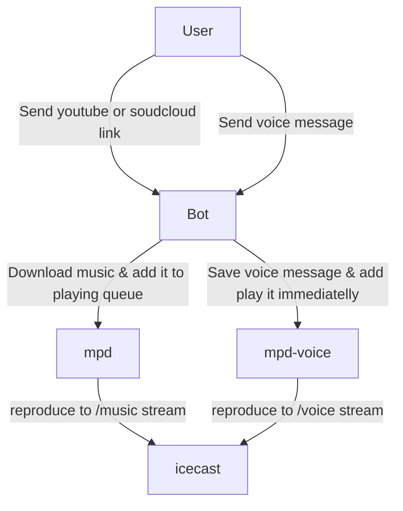

# Internet radio managed by telegram bot

## Architecture

## Installation

1. Register new bot asking [BotFather](https://t.me/botfather) and get a token
2. Edit following files replacing `hackme` with your secret password and putting corresponding tokens:
    - .env
    - mpd.music.conf
    - mpd.voice.conf
    - icecast.xml

3. run `docker-compose up -d`
4. You are awesome!

## Bot commands

/status 
/seek <position>
/next
/play
/stop
/move <from-position> <to-position> 
/del <position> 
/add <url_or_filename>
/playlist
