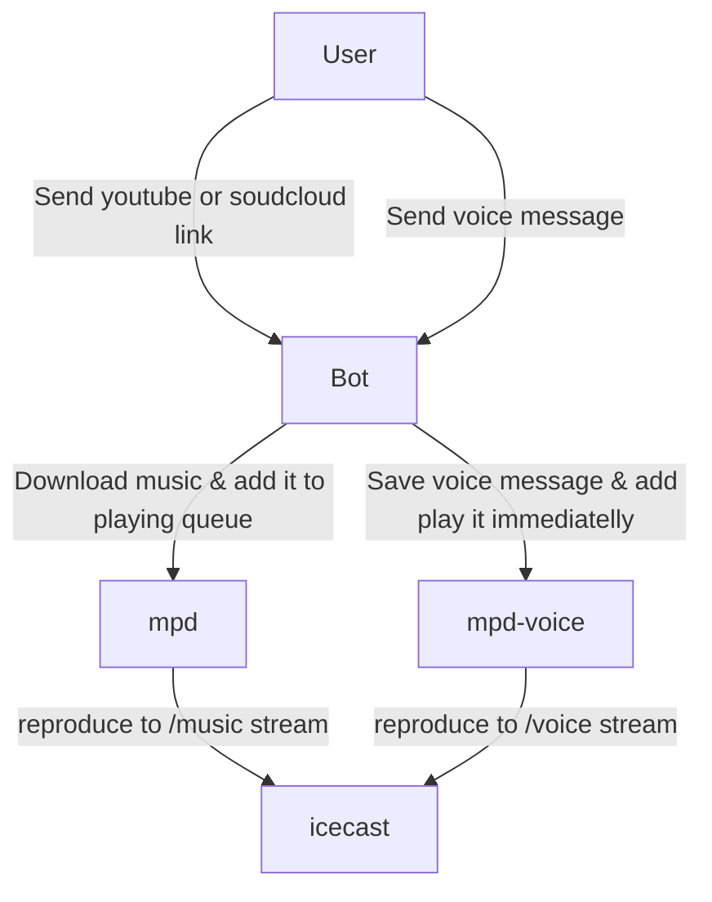

# Internet radio managed by telegram bot

## Architecture

## Installation

1. Register new bot asking [BotFather](https://t.me/botfather) and get a token
2. `git clone https://github.com/serg123e/irirangi.git`
3. `cd irirangi`
4. Edit following files replacing `hackme` with your secret password and putting corresponding tokens:
    - .env
    - mpd.music.conf
    - mpd.voice.conf
    - icecast.xml

5. Run `docker-compose build --build-arg UID="$(id -u)" --build-arg GID="$(id -g)"`
6. Run `docker-compose up -d`
7. Now write /start to your bot and add it as and admin to your favorite telegram group
8. You are awesome! Check http://your-host-name:8000/irirangi for the radio stream

## Bot commands
    
    /status 
    /seek <position>
    /next
    /play
    /stop
    /move <from-position> <to-position> 
    /del <position> 
    /playlist
    /add <url_or_filename>
    https://soundcloud.com/link/to/track
    https://music.youtube.com/watch?v=TRACK_TO_ADD
    
