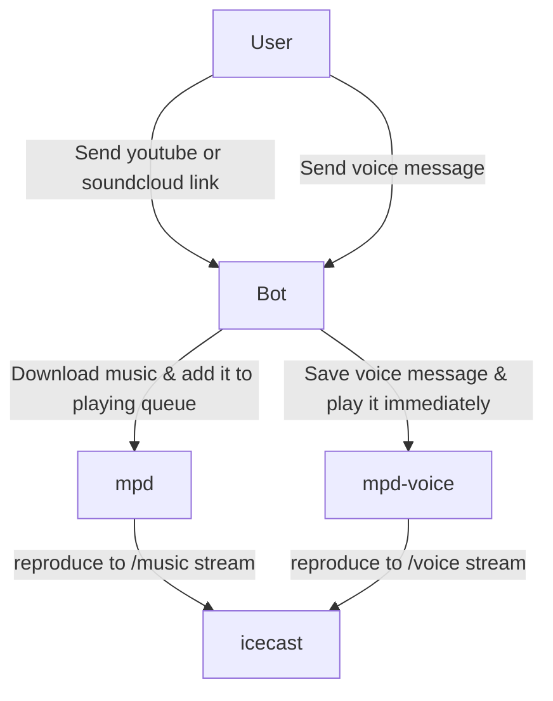

# Internet radio managed by telegram bot

## Architecture

```mermaid
flowchart TD
    User --->|Send youtube or soundcloud link| Bot
    Bot -->|Download music & add it to playing queue| mpd
    mpd -->|reproduce to /music stream| icecast
    User -->|Send voice message| Bot
    Bot -->|Save voice message & play it immediately| mpd-voice
    mpd-voice -->|reproduce to /voice stream| icecast
```

## Installation

1. Register new bot asking [BotFather](https://t.me/botfather) and get a token
2. `git clone https://github.com/serg123e/irirangi.git`
3. `cd irirangi`
4. `cp bot.env.example bot.env` and edit it:
    - Set `TELEGRAM_BOT_TOKEN` to your bot token
    - Set `ADMIN_USERNAMES` to comma-separated Telegram usernames who can manage playlists (leave empty to allow everyone)
5. Edit following files replacing `hackme` with your secret password:
    - mpd.music.conf
    - mpd.voice.conf
    - icecast.xml
6. Run `docker-compose build --build-arg UID="$(id -u)" --build-arg GID="$(id -g)"`
7. Run `docker-compose up -d`
8. Now write /start to your bot and add it as an admin to your favorite telegram group
9. You are awesome! Check http://your-host-name:8000/irirangi for the radio stream

## Access control

Set `ADMIN_USERNAMES` in `bot.env` to restrict who can manage playlists.

**Admin-only commands:** /add, /del, /move, /seek, /play, /stop, sending audio/voice/links

**Available to everyone:** /start, /next, /status, /playlist, /list

If `ADMIN_USERNAMES` is empty, all commands are available to everyone (default behavior).

## Bot commands

    /status
    /seek <position>
    /next
    /play
    /stop
    /move <from-position> <to-position>
    /del <position>
    /playlist
    /add <url_or_filename>
    https://soundcloud.com/link/to/track
    https://music.youtube.com/watch?v=TRACK_TO_ADD
